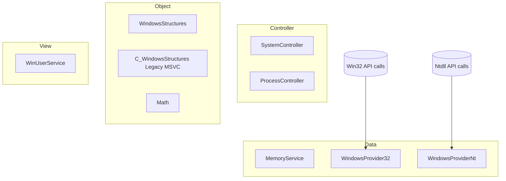

<table>
  <tr>
    <td>
        
    </td>
    <td>
      <h1>Corvus</h1>
      
      
      
      
      
    </td>
  </tr>
</table>

## Intro
Corvus is a Windows native SDK DLL (x86 / x64) written in ISO C++20 with a deliberately minimal, exceptionless C-style design.

It provides structured access to low-level Windows user-mode APIs, primarily:
- Win32
- Native NT (ntdll)

The project emphasizes architectural clarity, deterministic behavior, and explicit data modeling over convenience abstractions.
  
## Purpose
Corvus exposes Windows data: process, thread, module, handle, token, etc. information through a layered internal design.
It bridges raw native system calls and structured C++ data models without introducing hidden side effects or runtime magic.

The SDK is designed for:
- Process introspection
- Native structure mapping
- Handle and token analysis
- Architecture detection (x86 / x64 / WoW64)
- Low-level memory inspection (via `NtReadVirtualMemory` / `NtWriteVirtualMemory`)

As of now, it does **not** implement persistence mechanisms, obfuscation, or network behavior.

## Architecture
Corvus follows a layered MVC-inspired structure:

### DataProvisionLayer
Thin, explicit wrappers over Win32 and NT native calls.

These functions:
- Avoid hidden allocation patterns
- Avoid exceptions
- Prefer direct `NTSTATUS` / `BOOL` returns
- Expose buffer sizing explicitly where required

### DataTransferObjectLayer
Strongly defined data wrappers that unify structures across:
- ToolHelp32
- PSAPI
- Process Snapshot API
- Native NT structures

This layer normalizes disparate Windows APIs into coherent C++ structures while preserving native semantics.

### ControllerLayer
High-level orchestration classes that manage:
- Handle lifetime
- Object initialization & data population
- State tracking & state validation

Copy semantics are intentionally disabled to prevent unsafe handle duplication.

### ViewLayer
Contains raw user-interface-related utilities and WinUser helpers.
This layer is isolated from native process logic.

## Design Characteristics
- ISO C++20 (exceptionless style)
- Explicit resource ownership
- No hidden global state
- Minimal STL usage beyond containers and strings (C-style)
- Native NT structures preserved where meaningful
- Experimental NT structures are clearly marked `[[deprecated]]`
- Verbose naming convention
- Visual C++ XML documentation

## Build Requirements
Visual Studio (Desktop development with C++):
- MSVC x86 / x64 toolchain
- Windows 11 SDK
- ATL support (if enabled)
- vcpkg (optional)

## Namespace diagram

## DataTransferObject diagram(s)

