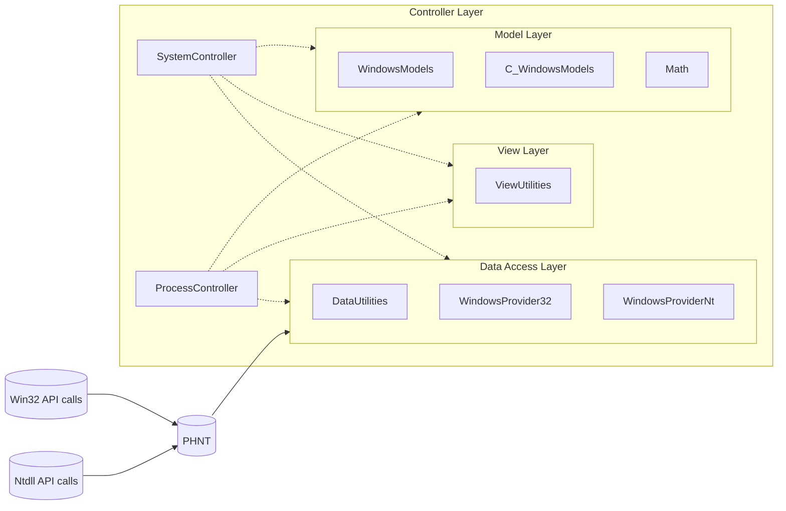

<table>
  <tr>
    <td>
        
    </td>
    <td>
      <h1>Corvus</h1>
      
      
      
      
      
      
      <h1>Muninn</h1>
      
      
      
      
      
      
      
    </td>
  </tr>
</table>

## Summary
<<<<<<< Updated upstream
Corvus is a Windows native SDK DLL (x86 / x64) written in ISO C++20 with a deliberately minimal, exceptionless C-style design.
=======
Muninn is a Windows SDK (x86/x64) implemented in C89 and C++17.
It exposes a minimal, exceptionless, C89 API for a stable C ABI,
enabling straightforward integration with languages such as C#, Rust, and Python.
>>>>>>> Stashed changes

The C89 API is part of the [Data Access Layer](#architecture) and interfaces with:
- Win32
- Native NT (ntdll)

The project emphasizes architectural clarity, deterministic behavior, explicity and support over convenience abstractions.

<<<<<<< Updated upstream
=======
> **Disclaimer**: This SDK project is relatively new and the API interface and architecture is constantly evolving. Some commits may not compile at this time.

>>>>>>> Stashed changes
## Table of contents
- [Summary](#summary)
- [Table of contents](#table-of-contents)
- [Purpose](#purpose)
- [Architecture](#architecture)
  - [DataAccessLayer](#dataaccesslayer)
  - [ModelLayer](#modellayer)
  - [ControllerLayer](#controllerlayer)
  - [ViewLayer](#viewlayer)
- [Design characteristics](#design-characteristics)
- [Namespace diagram](#namespace-diagram)
- [Documentation](#documentation)
- [Third-party Libraries](#third-party-libraries)
- [Build requirements](#build-requirements)
- [Contributors](#contributors)

## Purpose
Corvus exposes Windows data such as process, thread, module, handle, token, etc. information through a layered internal design.
It bridges raw native system calls and structured C++ data models without introducing hidden side effects or runtime magic.

The SDK is designed for:
- Process introspection
- Native structure mapping
- Handle and token analysis
- Architecture detection (x86 / x64 / WoW64)
- Low-level memory inspection (via `NtReadVirtualMemory` / `NtWriteVirtualMemory`)

As of now, it does **not** implement persistence mechanisms, obfuscation, or network behavior.

## Architecture
Corvus follows a layered MVC-inspired structure:

Layers

  
### DataAccessLayer
Minimal C89 wrappers around Windows API's like:
- Win32
- Native NT (ntdll)

These functions:
- Avoid exceptions
- Prefer direct `NTSTATUS` returns

### ModelLayer
Pure, strongly-defined data structures that unify data acquisition across:
- ToolHelp32
- PSAPI
- Process Snapshot API
- Native NT structures

### ControllerLayer
Higher-level singleton data access- and model orchestration classes that manage:
- Handle lifetime
- Object initialization
- Data population

Copy semantics are intentionally disabled to prevent unsafe resource duplication.

### ViewLayer
Contains raw user-interface-related utilities and WinUser helpers.
This layer is isolated from native process logic.

## Design characteristics
- ISO C++17 (exceptionless style) written in Visual Studio
- C89 / ANSI C written in Visual Studio Code using Cmake, Ninja-build and clang.
- Explicit resource ownership
- No hidden global state
- Minimal STL usage beyond containers and strings (C-style)
- Native NT structures preserved where meaningful
- Experimental NT structures are clearly marked `[[deprecated]]`
- Verbose naming convention
- Visual C++ XML documentation

## Namespace diagram

## Documentation 

  

Class Diagram Images

  

## Third-party Libraries
Process Hacker Native Types:
  - [MIT License](https://github.com/winsiderss/phnt/blob/fc1f96ee976635f51faa89896d1d805eb0586350/LICENSE)  
  - [GitHub phnt repository](https://github.com/processhacker/phnt)

## Build requirements
C++17 requires:
  - [Visual Studio](https://visualstudio.microsoft.com/)
  - [Desktop development with C++](https://learn.microsoft.com/en-us/cpp/build/vscpp-step-0-installation?view=msvc-170)

C89 / ANSI C requires:
  - [CMake](https://cmake.org/)
  - [Ninja-build](https://github.com/ninja-build/ninja)
  - [Visual Studio Developer Command Prompt](https://learn.microsoft.com/en-us/visualstudio/ide/reference/command-prompt-powershell?view=visualstudio)
  - [Clang](https://clang.llvm.org/)

## Contributors
Thanks to these wonderful people for contributing:

